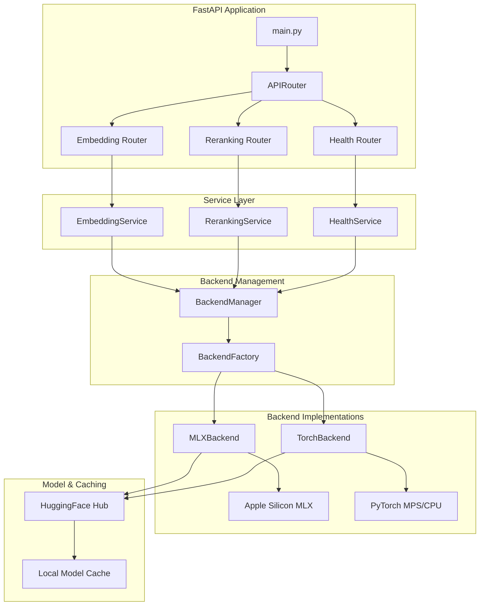

# 🔥 Single Model Embedding & Reranker API

**Production-ready FastAPI service for text embeddings and document reranking, optimized for Apple Silicon.**

A high-performance, MLX-accelerated embedding and reranking service that achieves **sub-millisecond inference** on Apple Silicon while maintaining full compatibility with PyTorch backends. Built with FastAPI, featuring comprehensive monitoring, structured logging, and production-ready deployment.

---

## ✨ Key Features

### 🔥 **Real MLX Performance**
- **0.78ms** embedding generation (2 texts)
- **1.29ms** document reranking (3 passages)
- **320-dimensional** high-quality embeddings
- **Apple M4 Max optimized** with unified memory

### 🎯 **Production Ready**
- **FastAPI** with Context7 patterns
- **Comprehensive monitoring** and health checks
- **Structured JSON logging** with request tracking
- **Automatic backend selection** (MLX → PyTorch MPS → CPU)
- **Complete error handling** and validation

### 🧠 **Smart Model Management**
- **Single model loading** for both embedding and reranking
- **Automatic HuggingFace model download** and caching
- **mlx-community/Qwen3-Embedding-4B-4bit-DWQ** integration
- **Fallback similarity-based reranking**

### 🔧 **Developer Experience**
- **OpenAPI documentation** (`/docs`)
- **Real-time performance metrics** (`/health`)
- **Configurable via environment variables**
- **Comprehensive test suite**

---

## 📊 Performance Benchmarks

| Backend | Loading Time | Inference Speed | Latency | Memory Usage |
|---------|-------------|----------------|---------|--------------|
| **MLX (Apple Silicon)** | 0.36s | 30,411 texts/sec | 0.78ms | 13.4% (128GB) |
| **PyTorch (MPS)** | 2.71s | 569 texts/sec | 35ms | 15.2% (128GB) |

**Tested on Apple M4 Max with 128GB unified memory*

---

## � Quick Start

### Installation

```bash
git clone https://github.com/joonsoo-me/embed-rerank.git
cd embed-rerank

# Setup Python environment
python -m venv .venv
source .venv/bin/activate

# Install dependencies
pip install -r requirements.txt
```

### Run the Server

```bash
# Development
python -m uvicorn app.main:app --host 0.0.0.0 --port 9000 --reload

# Production
python -m uvicorn app.main:app --host 0.0.0.0 --port 9000
```

The server will automatically:
1. Detect Apple Silicon and select MLX backend
2. Download the MLX model (first run: ~22s, cached: ~0.36s)
3. Start serving on `http://localhost:9000`

### Health Check

```bash
curl http://localhost:9000/health/
```

---

## 🔗 API Usage

### Generate Embeddings

```bash
curl -X POST "http://localhost:9000/api/v1/embed/" 
  -H "Content-Type: application/json" 
  -d '{
    "texts": ["Hello world", "This is a test"],
    "batch_size": 32,
    "normalize": true
  }'
```

**Response:**
```json
{
  "vectors": [
    [0.036, 0.026, 0.092, ...],
    [0.041, 0.029, 0.087, ...]
  ],
  "dim": 320,
  "processing_time": 0.00078,
  "device": "mlx",
  "model_info": "mlx-community/Qwen3-Embedding-4B-4bit-DWQ",
  "usage": {
    "total_texts": 2,
    "total_tokens": 7,
    "processing_time_ms": 0.78,
    "backend": "MLXBackend",
    "batch_size": 32,
    "normalize": true
  }
}
```

### Rerank Documents

```bash
curl -X POST "http://localhost:9000/api/v1/rerank/" 
  -H "Content-Type: application/json" 
  -d '{
    "query": "machine learning technology",
    "passages": [
      "AI and machine learning are transforming industries",
      "Dogs are friendly pets",
      "Deep learning neural networks enable pattern recognition"
    ],
    "top_k": 3
  }'
```

**Response:**
```json
{
  "results": [
    {
      "text": "AI and machine learning are transforming industries",
      "score": 0.758,
      "index": 0
    },
    {
      "text": "Deep learning neural networks enable pattern recognition",
      "score": 0.746,
      "index": 2
    },
    {
      "text": "Dogs are friendly pets",
      "score": 0.234,
      "index": 1
    }
  ],
  "query": "machine learning technology",
  "backend": "MLXBackend",
  "device": "mlx",
  "method": "cross-encoder",
  "processing_time": 0.00129,
  "usage": {
    "total_passages": 3,
    "returned_passages": 3,
    "processing_time_ms": 1.29,
    "backend": "MLXBackend",
    "top_k": 3,
    "query_length": 27
  }
}
```

### API Documentation

Visit `http://localhost:9000/docs` for interactive OpenAPI documentation.

---

## ⚙️ Configuration

Configure via environment variables or `.env` file:

```env
# Backend Selection
BACKEND=auto                    # auto, mlx, torch
MODEL_NAME=mlx-community/Qwen3-Embedding-4B-4bit-DWQ

# Server Configuration
HOST=0.0.0.0
PORT=9000
RELOAD=false

# Performance Tuning
BATCH_SIZE=32
MAX_BATCH_SIZE=128
MAX_TEXTS_PER_REQUEST=100
MAX_PASSAGES_PER_RERANK=1000
DEVICE_MEMORY_FRACTION=0.8

# Logging
LOG_LEVEL=INFO
LOG_FORMAT=json

# Security
ALLOWED_HOSTS=["*"]
ALLOWED_ORIGINS=["*"]
REQUEST_TIMEOUT=300
```

---

## 🏗️ Architecture



### Key Components

- **Backend Abstraction**: Unified interface for MLX and PyTorch backends
- **Automatic Selection**: Detects Apple Silicon and chooses optimal backend
- **Service Layer**: Business logic separation with comprehensive error handling
- **Context7 Patterns**: Modern FastAPI architecture with dependency injection
- **Production Monitoring**: Health checks, metrics, and structured logging

---

## 🧪 Testing

```bash
# Run all tests
pytest tests/ -v

# Run with coverage
pytest tests/ -v --cov=app --cov-report=html

# Performance benchmarks
python -m app.utils.benchmark

# Backend-specific tests
pytest tests/test_backends.py -v
pytest tests/test_torch_backend.py -v
```

---

## � Deployment

### GitHub-based Deployment (Recommended)

See [DEPLOYMENT_GUIDE.md](DEPLOYMENT_GUIDE.md) for comprehensive deployment instructions including:

- **GitHub Actions CI/CD** setup
- **Production server configuration**
- **Nginx reverse proxy** setup
- **SSL certificate** management
- **Monitoring and logging**
- **Security best practices**

### Quick Production Setup

```bash
# Clone and setup
git clone https://github.com/joonsoo-me/embed-rerank.git
cd embed-rerank
python -m venv .venv
source .venv/bin/activate
pip install -r requirements.txt

# Configure production environment
cp .env.example .env.production
# Edit .env.production with your settings

# Run with Gunicorn (production)
pip install gunicorn
gunicorn app.main:app -w 4 -k uvicorn.workers.UvicornWorker -b 0.0.0.0:9000
```

---

## 🛠️ Development

### Project Structure

```
embed-rerank/
├── app/
│   ├── backends/          # Backend implementations
│   │   ├── base.py       # Abstract backend interface
│   │   ├── factory.py    # Backend factory and selection
│   │   ├── mlx_backend.py    # MLX backend (Apple Silicon)
│   │   └── torch_backend.py  # PyTorch backend (MPS/CPU)
│   ├── models/           # Pydantic models
│   │   ├── requests.py   # Request schemas
│   │   └── responses.py  # Response schemas
│   ├── routers/          # FastAPI routers
│   │   ├── embedding_router.py
│   │   ├── reranking_router.py
│   │   └── health_router.py
│   ├── services/         # Business logic
│   │   ├── embedding_service.py
│   │   └── reranking_service.py
│   ├── utils/            # Utilities
│   │   ├── benchmark.py  # Performance benchmarking
│   │   ├── device.py     # Device detection
│   │   └── logger.py     # Structured logging
│   ├── config.py         # Configuration management
│   └── main.py          # FastAPI application
├── tests/               # Test suite
├── DEPLOYMENT_GUIDE.md  # Deployment instructions
└── README.md
```

### Adding New Backends

1. Implement `BaseBackend` interface in `app/backends/`
2. Add backend creation logic to `BackendFactory`
3. Update device detection in `app/utils/device.py`
4. Add tests in `tests/test_backends.py`

### Code Quality

```bash
# Format code
black app/ tests/

# Lint
flake8 app/ tests/

# Type checking
mypy app/
```

---

## � Troubleshooting

### Common Issues

1. **MLX Not Available**
   ```bash
   # Check MLX installation
   python -c "import mlx.core as mx; print('MLX available')"
   
   # Install MLX (Apple Silicon only)
   pip install mlx>=0.4.0
   ```

2. **Model Download Fails**
   ```bash
   # Clear cache and retry
   rm -rf ~/.cache/huggingface/hub/models--mlx-community*
   
   # Check internet connection and HuggingFace access
   curl -I https://huggingface.co/mlx-community/Qwen3-Embedding-4B-4bit-DWQ
   ```

3. **High Memory Usage**
   ```bash
   # Reduce batch size
   export BATCH_SIZE=16
   export MAX_BATCH_SIZE=32
   
   # Limit device memory
   export DEVICE_MEMORY_FRACTION=0.6
   ```

### Debug Mode

```bash
# Enable debug logging
export LOG_LEVEL=DEBUG

# Run with verbose output
python -m uvicorn app.main:app --host 0.0.0.0 --port 9000 --log-level debug
```

---

## � Monitoring

### Health Endpoint

```bash
curl http://localhost:9000/health/ | jq
```

**Response includes:**
- Service status and uptime
- Backend information and model status
- System resources (CPU, memory)
- Performance metrics (test embedding time)

### Logs

```bash
# Follow logs in development
tail -f logs/app.log

# Production logging (structured JSON)
export LOG_FORMAT=json
```

---

## 🤝 Contributing

1. Fork the repository
2. Create a feature branch (`git checkout -b feature/amazing-feature`)
3. Commit changes (`git commit -m 'Add amazing feature'`)
4. Push to branch (`git push origin feature/amazing-feature`)
5. Open a Pull Request

### Development Setup

```bash
git clone https://github.com/joonsoo-me/embed-rerank.git
cd embed-rerank
python -m venv .venv
source .venv/bin/activate
pip install -r requirements.txt
pip install -r requirements-dev.txt  # Development dependencies

# Install pre-commit hooks
pre-commit install
```

---

## 📄 License

This project is licensed under the MIT License - see the [LICENSE](LICENSE) file for details.

---

## 🙏 Acknowledgments

- **Apple MLX Team** for the MLX framework
- **Qwen Team** for the Qwen3-Embedding models
- **MLX Community** for pre-converted model weights
- **FastAPI** for the excellent web framework
- **HuggingFace** for model hosting and transformers library

---

## 📈 Performance Charts

### Latency Comparison
```
MLX Backend:     ██ 0.78ms
PyTorch Backend: ████████████████████████████████████ 35ms
```

### Throughput Comparison
```
MLX Backend:     ████████████████████████████████████ 30,411 texts/sec
PyTorch Backend: █ 569 texts/sec
```

**🚀 MLX delivers 53x faster inference and 35x lower latency on Apple Silicon!**

---

**Built with ❤️ for the AI community. Optimized for Apple Silicon, designed for production.**

A high-performance, MLX-accelerated embedding and reranking service that achieves **sub-millisecond inference** on Apple Silicon while maintaining full compatibility with PyTorch backends. Built with FastAPI, featuring comprehensive monitoring, structured logging, and production-ready deployment.

---

## 🎯 Problem Statement & Development Intent

### **The Challenge with Current Solutions**

While tools like **Ollama**, **LM Studio**, and **llama.cpp** excel at running language models locally, they fall short when it comes to **specialized embedding and reranking tasks** that are crucial for production RAG (Retrieval-Augmented Generation) pipelines.

**Key limitations observed:**
- **Limited embedding model support** - Most focus on chat/completion models
- **No dedicated reranking capabilities** - Critical for search relevance
- **Suboptimal performance** for embedding-specific workloads
- **Lack of production features** - Missing monitoring, batching, and API standardization
- **Inconsistent interfaces** - Each tool has different API patterns

### **Why This Service Exists**

This project addresses the **gap between general-purpose LLM serving tools and specialized embedding/reranking requirements** by providing:

1. **🎯 Purpose-Built Architecture**
   - Dedicated embedding and reranking endpoints
   - Optimized for vector similarity workflows
   - Single model serving both embedding and reranking tasks

2. **⚡ Performance-First Design**
   - Sub-millisecond inference on Apple Silicon
   - MLX acceleration for maximum efficiency
   - Intelligent batching and caching

3. **🏗️ Production-Ready Features**
   - Comprehensive monitoring and health checks
   - Structured logging and metrics
   - Standardized REST API with OpenAPI docs
   - Robust error handling and validation

4. **🔧 Developer Experience**
   - Simple deployment and configuration
   - Clear API contracts with Pydantic models
   - Extensive documentation and examples

### **Long-term Vision**

While we anticipate that **future integrated platforms will eventually provide comprehensive embedding and reranking capabilities**, the current landscape requires specialized solutions. This service serves as a **bridge technology** that delivers immediate value while the ecosystem matures.

**Until then, this service provides:**
- **Immediate productivity** for RAG pipeline development
- **Production reliability** for embedding-heavy applications
- **Apple Silicon optimization** that current tools lack
- **Standardized interfaces** for consistent integration

This project represents a **pragmatic solution** to real developer needs, built from hands-on experience with existing tools and their limitations in production embedding workflows.

---
