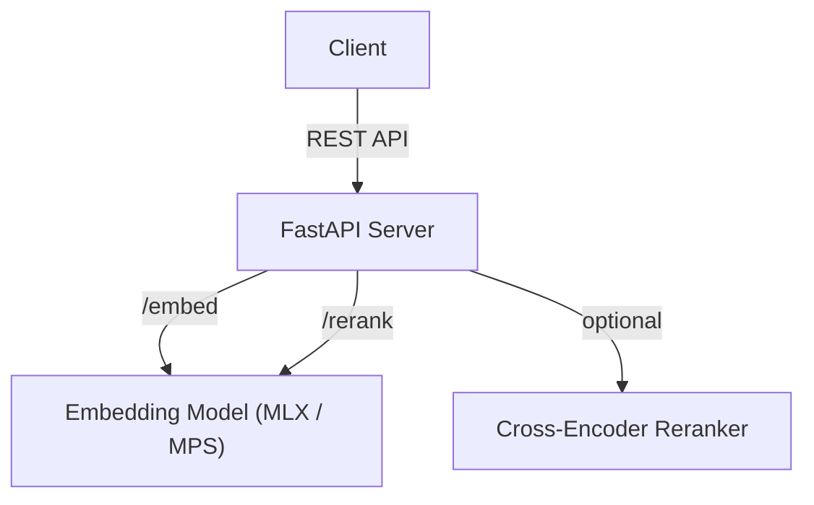

# 🔥 Single Model Embedding & Reranker API

A **Python-based API service** built with **FastAPI** that provides **text embeddings** and **document reranking**.
Designed for macOS with **Apple Silicon acceleration (MLX / MPS)**, this project loads a single model into memory to serve both embedding and reranking requests, enabling **fast, resource-efficient NLP operations**.

---

## ✨ Features

* ⚡ **High-Quality Multilingual Embeddings**
  Powered by [Qwen3-Embedding-4B](https://huggingface.co/Qwen/Qwen3-Embedding-4B), delivering strong performance across multiple languages.

* 🔎 **Reranking Support**
  Rerank passages relative to a query using embedding similarity.
  Optional **Cross-Encoder reranker** (e.g., MiniLM, BGE) can be enabled for higher precision.

* 🧠 **Single In-Memory Model**
  Loads the embedding model once at startup and reuses it for both endpoints.

* 🚀 **Apple Silicon Acceleration**

  * **MLX backend**: Uses Apple’s MLX engine when MLX-format weights are available.
  * **PyTorch MPS backend**: Falls back to Metal Performance Shaders (MPS) when MLX isn’t available.
  * Automatically chooses the best backend at runtime.

* 🛠 **Extensible Design**
  Modular backend layer allows easy extension with additional models or inference engines.

---

## 📦 Installation

```bash
git clone https://github.com/your-username/qwen3-embedding-reranker-api.git
cd qwen3-embedding-reranker-api

# Python deps
pip install -r requirements.txt
```

Requirements:

* Python 3.10+
* PyTorch with MPS support (`pip install torch`)
* FastAPI + Uvicorn
* sentence-transformers (for PyTorch backend)
* (Optional) `mlx`, `mlx-lm` for MLX backend

---

## ⚙️ Configuration

Control backend and models via environment variables:

```bash
# Backend: "torch" (default) or "mlx"
export BACKEND=torch

# Model for embedding
export MODEL_NAME="Qwen/Qwen3-Embedding-4B"

# Path for MLX model (if BACKEND=mlx)
export MLX_MODEL_PATH="./mlx-qwen3-emb-4b"

# Optional cross-encoder reranker
export CROSS_ENCODER_MODEL="cross-encoder/ms-marco-MiniLM-L-6-v2"
```

---

## 🚀 Running the Server

```bash
uvicorn app:app --host 0.0.0.0 --port 9000
```

Health check:

```bash
curl http://localhost:9000/health
```

---

## 🔗 API Endpoints

### 1. Generate Embeddings

`POST /embed`

```json
{
  "texts": ["What is RAG?", "Qdrant is a vector database"],
  "batch_size": 32
}
```

Response:

```json
{
  "vectors": [[0.12, -0.43, ...], [0.54, 0.91, ...]],
  "dim": 1024,
  "backend": "torch:Qwen/Qwen3-Embedding-4B",
  "device": "mps"
}
```

---

### 2. Rerank Passages

`POST /rerank`

```json
{
  "query": "How to integrate Qdrant?",
  "passages": [
    "Qdrant is a Rust-based vector database",
    "n8n can call Qdrant over HTTP",
    "LM Studio runs local models"
  ],
  "top_k": 2,
  "use_cross_encoder": true
}
```

Response:

```json
{
  "results": [
    {"text": "Qdrant is a Rust-based vector database", "score": 0.92, "index": 0},
    {"text": "n8n can call Qdrant over HTTP", "score": 0.75, "index": 1}
  ],
  "backend": "torch:Qwen/Qwen3-Embedding-4B",
  "device": "mps",
  "method": "bi+cross-encoder"
}
```

---

## 📐 Architecture



---

## 🛣 Roadmap

* [ ] MLX backend full implementation for Qwen3 models
* [ ] Dockerfile with multi-arch build (arm64/amd64)
* [ ] Streaming/batch rerank optimization
* [ ] n8n integration template for RAG pipelines
* [ ] Open WebUI plugin connector

---

## 📜 License

MIT License. See [LICENSE](LICENSE) for details.

---

👉 This project is designed to be the **building block for local-first RAG pipelines** — connect it with **Qdrant**, **n8n**, or **Open WebUI** for a fully private, high-performance AI workflow.
